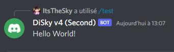

# 💬 Simple Messages

DiSky allows you to send or reply to messages. Although simple text works, bots can also use "embeds", with different ways to organize the structure of your message.

### Simple Text Message

Simple text messages are just ... text! Use the `post` effect (or `reply` if you're in a DiSky event) and just specify the text you can send:

```applescript
reply with "Hello World!"
```

```applescript
post "Hello World!" to text channel with id "000" # specific channel
```

<figure><figcaption><p>Result of a response in a slash command</p></figcaption></figure>

### Simple Embed Message

An embed can have different properties:

* Title (<mark style="color:purple;">+ title URL</mark>)
* Author (<mark style="color:purple;">+ author icon & URL</mark>)
* Description
* Color
* Image
* Thumbnail
* Footer (<mark style="color:purple;">+ footer icon</mark>)
* Timestamp
* Fields (inline or not)

Here's an example embed containing all the above properties:

<figure><figcaption><p>Full example of an embed</p></figcaption></figure>


You cannot set a "sub" property (<mark style="color:purple;">in purple</mark>) without setting the main property.

For example, you can't set an author icon without an author.


The code for the above embed is the following:

```applescript
make embed:
    set title of embed to "Title"
    set title url of embed to "https://www.crunchyroll.com/fr/tonikawa-over-the-moon-for-you"
    
    set description of embed to "Description%nl%The title leads to the URL, if given"
    
    set author of the embed to "Author name (Can point to URL)" # author must be set first
    set author icon of embed to "https://cdn.discordapp.com/emojis/825811394963177533.png?v=1"
    set author url of embed to "https://www.youtube.com/watch?v=i33DB6R8YUY"
    
    set embed color of the embed to orange
    
    add inline field named "Field Name" with value "Colour sets %nl%< that" to fields of embed
    add inline field named "Field Name" with value "Color is a java Color%nl%Not a string" to fields of embed
    add inline field named "Field Name" with value "Field value" to fields of embed
    add field named "Non-inline field name" with value "The number of fields that can be shown on the same row is limited to 3, but is limited to 2 when an image is included" to fields of embed
    
    set footer of embed to "Footer text"
    set footer icon of embed to "https://cdn.discordapp.com/emojis/825811394963177533.png?v=1"
    
    set image of embed to "https://media.discordapp.net/attachments/237757030708936714/390520880242884608/8xAac.png?width=508&height=522"
    set thumbnail of embed to "https://cdn.discordapp.com/emojis/825811394963177533.png?v=1"
    set timestamp of embed to now
```

Once the section is run, you can post/reply with the last created embed, such as:

```applescript
make embed:
    ...
reply with last embed
```

```applescript
make embed:
    ...
post last embed to text channel with id "000"
```
