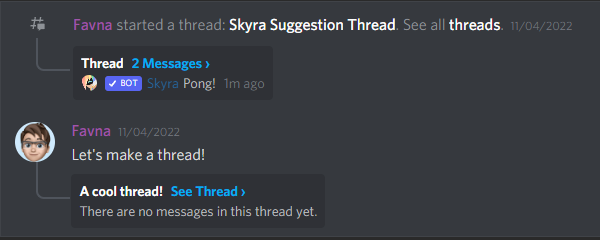

# 📜 TranSkript


This is a **premium** module and can be accessed through [**Patreon**](https://www.patreon.com/itsthesky)****


### Overview

This module will provide support for Discord(like website generation. You'll be able to re-create and save forever a conversation while including the replies, attachments, colors, references, and much more!

#### What can be saved?

* The message's content (formatted, aka **bold**, _italic_, etc...)
* Code blocks/inline code
* Spoilers/quotes
* Attachments
* Embeds
* Reactions, with their count
* Referenced message
* Slash commands
* Webhook & bot messages
* Components (buttons)

#### Examples (These are NOT DISCORD)

<figure><figcaption><p>Simple discussion, featuring mentions, role's colors &#x26; a bot.</p></figcaption></figure>

<figure><figcaption><p>Several links &#x26; their rendering</p></figcaption></figure>

<figure><figcaption><p>Threads/post creation</p></figcaption></figure>

<figure><figcaption><p>Replies</p></figcaption></figure>

<figure><figcaption><p>Buttons</p></figcaption></figure>

### Usage

There's only one syntax for this module, where you can generate a template according to two contexts:

* **Referencing a channel.** The module will retrieve the last 100 messages (that's the max) and create history on them.
* **Referencing specific messages.**

```applescript
set {_channel} to event-channel # can be any messaging channel, including private
generate transcript from channel {_channel} and store it in "plugins/ts.html"
```

Or, if you have a list of messages:

```applescript
set {_messages::*} to ... # specify the messages there
generate transcript from messages {_messages::*} and store it in "plugins/ts.html"
```
